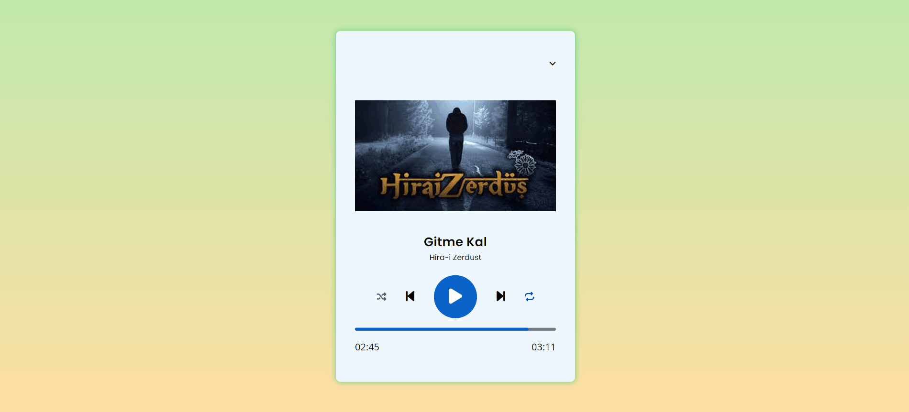

# MP3 Player Projesi

Bu proje, HTML, CSS ve JavaScript kullanılarak oluşturulmuş basit bir MP3 çalar uygulamasını içerir.

## Özellikler

- **Temiz Arayüz**: Kolay kullanım için basit ve düzenli bir arayüz.
- **Oynatma Kontrolleri**: Oynatma, duraklatma, ileri ve geri sarma gibi temel oynatma kontrollerine sahiptir.
- **Çalma Listesi Desteği**: Birden fazla MP3 dosyasını çalma listesine ekleyebilirsiniz.

## Kullanım

1. Projeyi klonlayın veya indirin.
2. İndirdiğiniz dizine gidin ve `index.html` dosyasını bir tarayıcıda açın.
3. MP3 dosyalarını yükleyin ve çalmaya başlayın!

## Katkıda Bulunma

- Her türlü katkıya açığız. Lütfen bir sorun bulursanız veya bir öneriniz varsa GitHub üzerinden bir konu açın veya bir pull isteği gönderin.

